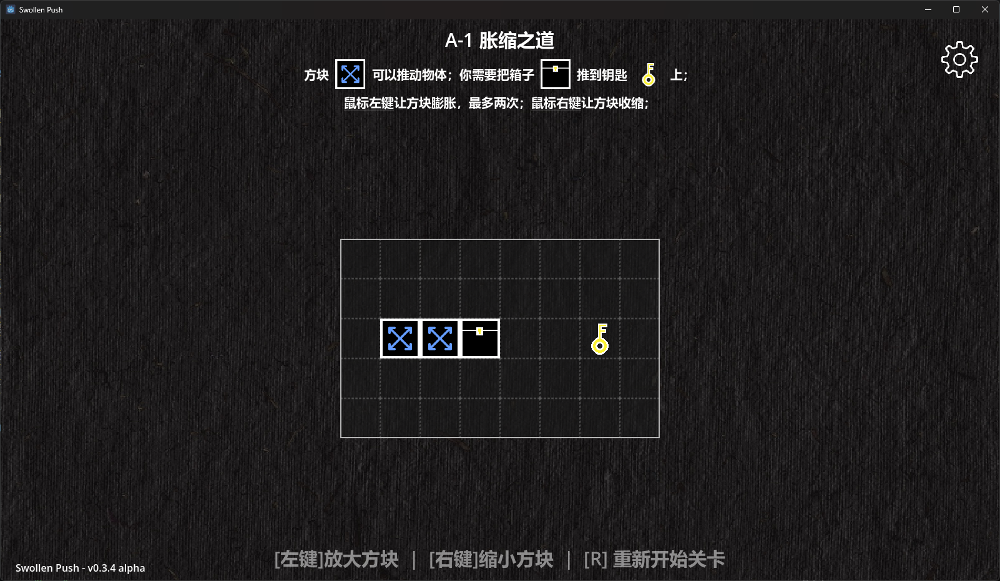
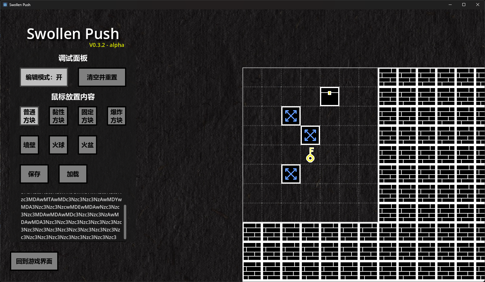

# Swollen Push
（中文名：胀缩）

这是一个为Gamejam而写的类推箱子游戏。

当前版本：0.3.3

**内置一系列关卡，已经可以体验了！**

### 操作说明
鼠标左键：膨胀方块

鼠标右键：收缩方块

[编辑模式]

在游戏界面下按“P”可以切出调试面板和编辑模式入口；

鼠标左键：放置内容

鼠标右键：清除内容

目前可以设置的物体有：方块（普通、黏性、固定、爆炸）、箱子/火球、钥匙/火盆，以及墙壁（在游戏界面会显示为地图边界）；

保存：将当前地图保存为一个Base64的字符串；

读取：将地图字符串复制到文本框中即可读取；

## 规则
游戏里有三种物体：**方块、火球和火盆**；

游戏的目标是**把火球推到火盆里**；

**方块可以改变大小**：鼠标左键方块使其膨胀，右键使其收缩——可以利用这一点推动火球；

方块的大小有1x1、3x3、5x5三种形态；

方块无法超出地图边界；

火球和火盆都可以被推动或黏连，当二者在一格中相遇时即为通关；

方块有**四种**类型：**普通方块、黏性方块、固定方块、爆炸方块**；

普通方块可以被其它方块推动或黏住；

黏性方块可以黏住其接触到的物体，除了固定方块；

固定方块无法被其它方块推动和黏住；

爆炸方块具有一次额外膨胀，且在此膨胀后会爆炸消失，除此之外与普通方块无异；爆炸可以无视边界和固定方块膨胀，但推不动固定方块；

**现在新增了可以自由放置方块的关卡......**

## 界面展示

